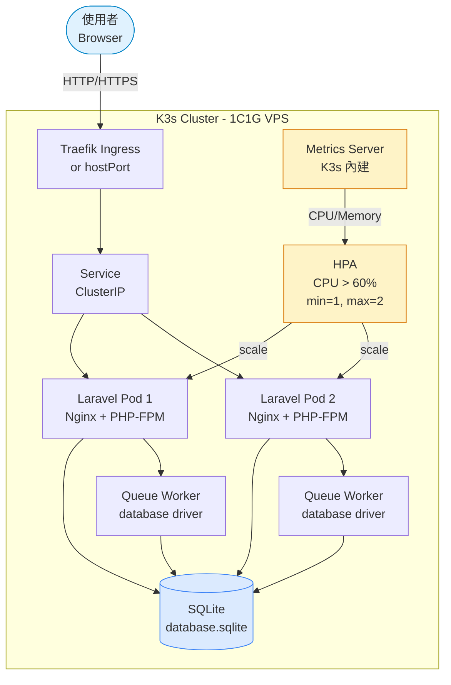
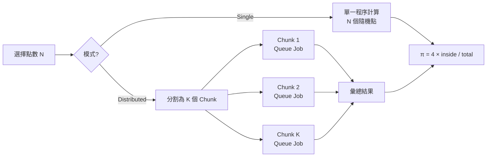
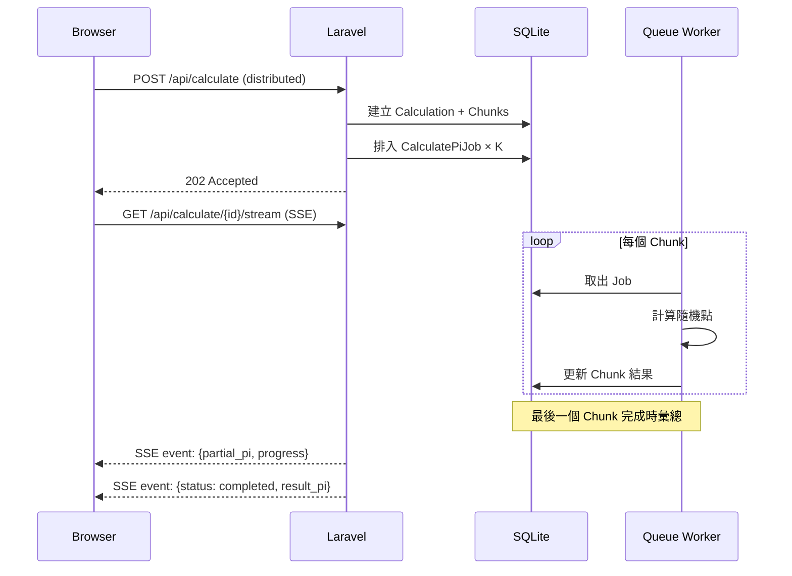

# 系統架構

## 架構總覽

## 蒙地卡羅演算法流程

蒙地卡羅法利用隨機採樣估算圓周率 π：

1. 在單位正方形 (0,0)-(1,1) 內隨機產生 N 個點
2. 計算落在四分之一圓（半徑 = 1，圓心在原點）內的點數 M
3. π ≈ 4 × M / N（因為四分之一圓面積 = π/4，正方形面積 = 1）

## 分散式計算協調

### Distributed 模式流程

1. **POST /api/calculate** (`mode=distributed`) 建立 `Calculation` 記錄
2. **DistributedCalculator** 將 total_points 切成多個 `CalculationChunk`
3. 每個 chunk 發派 `CalculatePiJob` 至 **database queue**
4. **Queue Worker**（Supervisor 管理）消費 job，各自計算後回寫 chunk 結果
5. 最後一個 chunk 完成時，觸發彙總：加總 inside/total，計算最終 π
6. 前端透過 **SSE** (`GET /api/calculate/{id}/stream`) 輪詢 DB 取得即時進度

## K8s 整合要點

### 部署元件

| 元件 | 用途 |
|------|------|
| Namespace `pi-k3s` | 隔離資源 |
| Deployment `laravel-app` | Laravel Pod（含 Nginx、PHP-FPM、Queue Worker） |
| Service `laravel-service` | ClusterIP，Pod 間負載均衡 |
| HPA | CPU > 60% 觸發擴展，min=1 max=2 |
| ServiceAccount + RBAC | 讓 Pod 內可查詢 K8s API（Pod 狀態、HPA） |
| ConfigMap / Secrets | 環境變數與敏感設定 |

### RBAC 設計

Pod 內的 `K8sClientService` 透過 ServiceAccount token 存取 K8s API：

- **Role**: 允許 `get`/`list` pods、pods/log、horizontalpodautoscalers（namespace 限定 `pi-k3s`）
- **ClusterRole**: 允許 `get`/`list` nodes、pods.metrics.k8s.io（跨 namespace metrics）

### 1C1G 限制與優化

- **SQLite** 取代 MySQL：省去獨立 DB 程序的記憶體開銷
- **Database Queue** 取代 Redis：Queue Worker 直接讀寫 SQLite jobs 表
- **PHP-FPM static pool**：2 workers，避免動態 fork 的記憶體波動
- **OPcache 48MB**：預載 PHP bytecode，降低 CPU 使用
- **停用 Traefik**：使用 hostPort 直接暴露，省約 100MB RAM

## API 端點

| 方法 | 路徑 | 說明 |
|------|------|------|
| POST | `/api/calculate` | 提交計算任務（single 返回 201，distributed 返回 202） |
| GET | `/api/calculate/{id}` | 查詢計算結果（支援 ID 或 UUID） |
| GET | `/api/calculate/{id}/stream` | SSE 即時進度串流 |
| GET | `/api/history` | 最近 30 筆已完成計算 |
| GET | `/api/k8s/status` | Pod 數量、HPA 狀態 |
| GET | `/api/k8s/metrics` | Pod CPU/Memory 指標 |
| POST | `/api/ai/ask` | AI 助手（SSE 串流，需 OPENAI_API_KEY） |
